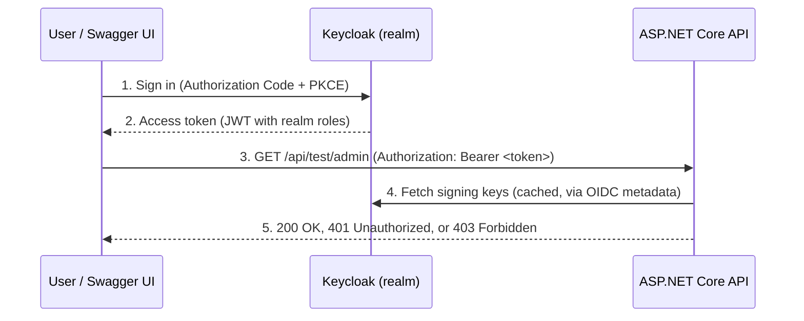

# Keycloak Authentication for ASP.NET Core (.NET 10)


A focused reference API showing how to secure an **ASP.NET Core Web API** with **Keycloak** as the OpenID Connect identity provider. It covers JWT bearer validation, realm-role based authorization, and signing in directly from **Swagger UI** using the Authorization Code flow with **PKCE**.

Keycloak runs on **Azure Container Apps** and the API is deployed to **Azure App Service**.

---

## What this demonstrates

- **JWT bearer validation** against a Keycloak realm (authority, issuer, signing keys discovered automatically from the realm's OIDC metadata)
- **Role-based authorization** using Keycloak realm roles (`Admin`, `User`) mapped to ASP.NET Core roles
- **Policy-based authorization** (`AdminPolicy`, `UserPolicy`)
- **Swagger UI login** with a public Keycloak client using Authorization Code + PKCE, so endpoints can be tested without copying tokens by hand
- **Strongly typed settings** for Keycloak and Swagger configuration
- **Container-ready** build with a multi-stage Dockerfile

---

## How it works



The API never sees user credentials. It only validates the token's signature, issuer and lifetime, then checks the roles inside it.

---

## Endpoints

| Method | Route | Access | Response |
|---|---|---|---|
| GET | `/api/test/public` | Anyone | `Public endpoint` |
| GET | `/api/test/secure` | Any authenticated user | `Authenticated users only` |
| GET | `/api/test/user` | Realm role `User` | `User only` |
| GET | `/api/test/admin` | Realm role `Admin` | `Admin only` |

---

## Tech stack

| Area | Technology |
|---|---|
| Framework | ASP.NET Core Web API (.NET 10) |
| Identity provider | Keycloak (OpenID Connect / OAuth 2.0) |
| Authentication | `Microsoft.AspNetCore.Authentication.JwtBearer` |
| API docs | Swashbuckle (Swagger UI with OAuth2 + PKCE) |
| Hosting | Azure Container Apps (Keycloak), Azure App Service (API) |
| Containers | Docker, .NET SDK container support |

---

## Project structure

```
keycloakapi-Demo/
├── Controllers/
│   └── TestController.cs            # Public, authenticated and role-protected endpoints
├── Extensions/
│   └── ServiceCollectionExtensions.cs  # AddAuthenticationAndAuthorization(), AddSwagger()
├── Settings/
│   ├── KeycloakSettings.cs          # Authority, issuer, HTTPS metadata
│   └── SwaggerSettings.cs           # Authorization/token URLs and scope for Swagger UI
├── Program.cs
├── appsettings.json
└── Dockerfile
```

---

## Getting started

### Prerequisites

- [.NET 10 SDK](https://dotnet.microsoft.com/download)
- [Docker](https://www.docker.com/) (to run Keycloak locally)

### 1. Run Keycloak locally

```bash
docker run -p 8080:8080 \
  -e KC_BOOTSTRAP_ADMIN_USERNAME=admin \
  -e KC_BOOTSTRAP_ADMIN_PASSWORD=admin \
  quay.io/keycloak/keycloak:latest start-dev
```

Open http://localhost:8080 and sign in with `admin` / `admin`.

### 2. Configure the realm

1. Create a realm named `keycloak-demo`.
2. Create a client:
   - **Client ID:** `public-client`
   - **Client authentication:** Off (public client)
   - **Standard flow:** On
   - **Valid redirect URIs:** `https://localhost:7179/swagger/oauth2-redirect.html`
   - **Web origins:** `https://localhost:7179`
   - Under **Advanced**, set **PKCE method** to `S256`
3. Create realm roles `Admin` and `User`.
4. Create two users, set passwords, and assign one `Admin` and the other `User`.
5. Map realm roles to a flat claim so ASP.NET Core can read them. Go to **Clients → public-client → Client scopes → public-client-dedicated → Add mapper → By configuration → User Realm Role**, then set:
   - **Token claim name:** `roles`
   - **Multivalued:** On and Off
   - **Add to access token:** On

### 3. Configure the API

Put your local Keycloak settings in `appsettings.Development.json`:

```json
{
  "Keycloak": {
    "Authority": "http://localhost:8080/realms/keycloak-demo",
    "ValidIssuer": "http://localhost:8080/realms/keycloak-demo",
    "RequireHttpsMetadata": false,
    "Swagger": {
      "AuthorizationUrl": "http://localhost:8080/realms/keycloak-demo/protocol/openid-connect/auth",
      "TokenUrl": "http://localhost:8080/realms/keycloak-demo/protocol/openid-connect/token",
      "Scope": "openid"
    }
  }
}
```

### 4. Run the API

```bash
dotnet run --launch-profile https
```

Open https://localhost:7179/swagger, click **Authorize**, sign in through Keycloak, and call the protected endpoints.

### Test with curl (optional)

For quick testing, enable **Direct access grants** on the client and request a token:

```bash
TOKEN=$(curl -s -X POST \
  "http://localhost:8080/realms/keycloak-demo/protocol/openid-connect/token" \
  -d "grant_type=password" -d "client_id=public-client" \
  -d "username=<user>" -d "password=<password>" | jq -r .access_token)

curl -k -H "Authorization: Bearer $TOKEN" https://localhost:7179/api/test/admin
```

> The password grant is for local testing only. Real clients should use the Authorization Code flow with PKCE, as Swagger UI does.

---

## Docker

```bash
docker build -t keycloak-demo-api .
docker run -p 8080:8080 keycloak-demo-api
```

---

## Design notes

- **Audience validation is off** to keep the demo simple. In production, add an *Audience* mapper in Keycloak and set `ValidateAudience = true` with the API's client ID as the audience.
- **`RequireHttpsMetadata = false`** is only for local development against `http://localhost`. Keep it `true` everywhere else.
- **Signing keys are not configured by hand.** The JWT handler downloads them from the realm's `/.well-known/openid-configuration` and refreshes them when Keycloak rotates keys.

---

## Author

**Syed Iqbal** · Senior .NET Developer
[LinkedIn](https://www.linkedin.com/in/syed--iqbal/) · [GitHub](https://github.com/siqbalk)
